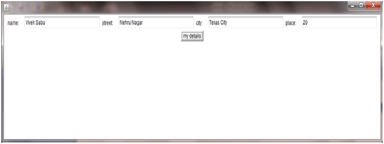
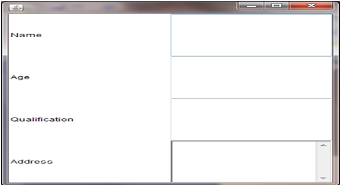
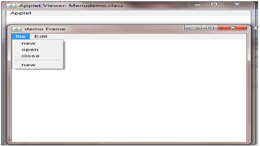
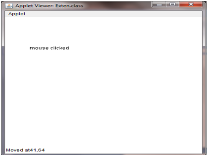

#JAVA LAB MANUAL

Refer to the HTML version for the table of contents [here](https://rawgit.com/kgashok/orientations/master/javaLab/javaLabManual.html)

[TOC] 

##Ex.No:1 Write a Java Applications to extract a portion of a character string and print the extracted string.**
```java
import java.io.*";

import java.util.Scanner;

public class ExtractString

{

 public static void main(String args[])

  {

    String str,substr;

    int idx1,idx2;

    Scanner in = new Scanner (System.in);

    System.out.println("Enter the String : ");

    str=in.next();

    System.out.println("Enter the index 1 : ");

    idx1 = in.nextInt();

    System.out.println("Enter the index 2 : ");

    idx2 = in.nextInt();

    substr=str.substring(idx1,idx2);

    System.out.println("The Substring is : " + substr);

  }

}
```
**COMMAND TO EXECUTE:**

c:\Program Files\java\jdk1.7.0\_01\bin&gt;javac  ExtractString.java

c:\Program Files\java\jdk1.7.0\_01\bin&gt;java  ExtractString

**OUTPUT:**

Enter the string                :

JavaProgramming

Enter the index1        :

0

Enter the index2        :

4

The Substring is         : Java


##Ex.No:2 Write a Java Program to implement the concept of multiple inheritance using Interfaces.**
```java
import java.io.*";

class student

{

int rno;

String name="Smith";

void getno(int n)

{

rno=n;

}

void Putrno()

{

System.out.println("Rno:"+rno);

System.out.println("Name:"+name);

}

}

class test extends student

{

int mark1,mark2;

void getmarks(int m1,int m2)

{

mark1=m1;

mark2=m2;

}

public void Putmarks()

{

System.out.println("Mark1:"+mark1);

System.out.println("Mark2:"+mark2);

}

}

interface Sports

{

int Sportsmark=75;

void Putmarks();

}

class result extends test implements Sports

{

int total;

public void putmarks()

{

System.out.println("Sportmark="+Sportsmark);

}

void display()

{

total=mark1+mark2+Sportsmark;

Putrno();

Putmarks();

putmarks();

System.out.println("Total marks:"+total);

}

}

class MultipleInheritance

{

public static void main (String args[])

{

result Stud = new result();

Stud.getno(1000);

Stud.getmarks(75,100);

Stud.display();

}

}
```
###COMMAND TO EXECUTE:**

c:\Program Files\Java\JDK17~1.0\_0\bin&gt;javac  MultipleInheritance.java

c:\Program Files\Java\JDK17~1.0\_0\bin&gt;java  MultipleInheritance

###OUTPUT:

```
Interface using multiple inheritance

Area of rectangle=20000.0

Area of circle=314.0
```

##Ex.No:3 Write a Java Program to create an Exception called payout-of-bounds and throw the exception**.
```java
import java.io.*";

import java.lang.*";

class ExceptionClass

{

public static void main(String args[])throws IOException

{

int payamt;

DataInputStream in=new DataInputStream(System.in);

System.out.println("\n\npay out of bound exception");

System.out.println("* * *");

System.out.println("\n enter a basic pay amount");

payamt =Integer.parseInt(in.readLine());

try

{

if(payamt&gt;1000)

throw new payoutofBoundException("Basic pay is out of bound");

else

System.out.println("\n given basic pay is:"+payamt);

}

catch(Exception e)

{

System.out.println("caught:"+e);

}

}

}

class payoutofBoundException extends IOException

{

//String s;

payoutofBoundException(String message)

{

// s=message;

 System.out.println(message);

}

}
```
**COMMAND TO EXECUTE:**

c:\Program Files\Java\JDK17~1.0\_0\bin&gt;javac PayOutOfBoundExceptionMain.java

c:\Program Files\Java\JDK17~1.0\_0\bin&gt;java PayOutOfBoundExceptionMain

**OUTPUT:**

Enter the amount lesser than 1000-10000

5000 Correct amount entered


##Ex.No:4 Write a Java Program to implement the concept of multithreading with the use of any three multiplication tables and assign three different priorities to them.**
```java
import java.io.*";

import java.lang.Thread;

class A extends Thread

{

public void run()
{
int i=0,j=2,k;
for(i=1;i<=4;i++)
{
k=i*j;
System.out.println("From thread A:"+i+"*"+j+"="+k);
}

System.out.println("Exit fromA");

}

}

class B extends Thread

{

public void run()

{

int a,b=3,c;

for(a=1;a<=4;a++)

{

c=a*b;

System.out.println("From thread B: "+a+"*"+b+"="+c);

}

System.out.println("Exit from B");

}

}

class C extends Thread

{

public void run()

{

int x,y=5,z;

for(x=1;x<=4;x++)

{

z=x*y;

System.out.println("From thread C:"+x+"*"+y+"="+z);

}

System.out.println("Exit from C");

}

}

class ThreadTest

{

public static void main(String args[])

{

int x=0;

A threadA=new A();

B threadB=new B();

C threadC=new C();

threadC.setPriority(Thread.MAX\_PRIORITY);

threadB.setPriority(threadA.getPriority()+x);

threadC.setPriority(Thread.MIN\_PRIORITY);

threadB.setPriority(threadA.getPriority()+x);

threadC.setPriority(Thread.MIN\_PRIORITY);

System.out.println("start thread A");

threadA.start();

System.out.println("start thread B");

threadB.start();

System.out.println("start thread c");

threadC.start();

}

}
```
**COMMAND TO EXECUTE:**

D:\Program Files (x86)\Java\jdk1.7.0\_01\bin&gt;javac ThreadTest.java

D:\Program Files (x86)\Java\jdk1.7.0\_01\bin&gt;java ThreadTest

###OUTPUT:

```
start thread A
start thread B
From thread A:1*2=2
start thread c
From thread B: 1*3=3
From thread A:2*2=4
From thread A:3*2=6
From thread B: 2*3=6
From thread A:4*2=8
Exit fromA
From thread C:1*5=5
From thread C:2*5=10
From thread B: 3*3=9
From thread C:3*5=15
From thread B: 4*3=12
From thread C:4*5=20
Exit from B
Exit from C
```


##Ex no:5 Write a Java Program to draw several shapes in the created windows.**
```java
import java.awt.*";

import java.applet.*";

public class shapes extends Applet

{

int x1[]={60,240,440,40};

int y1[]={60,240,40,40};

int  n1=4;

public void paint(Graphics g)

{

g.drawPolygon(x1,y1,n1);

g.drawLine(20,20,160,280);

g.drawRect(300,200,160,280);

g.fillRect(200,200,80,40);

g.fillRoundRect(40,320,20,60,10,10);

g.drawRoundRect(20,300,160,100,20,20);

g.drawOval(550,400,100,40);

}

}
```
/"&lt;html&gt;

&lt;head&gt;

&lt;applet code="shapes",height=400 width=400&gt;

&lt;/applet&gt;

&lt;/head&gt;

&lt;/html&gt;"/

**COMMAND TO EXECUTE:**

c:\Program Files\Java\jdk1.7.0\_01\bin&gt;javac shapes.java

c:\Program Files\Java\jdk1.7.0\_01\bin&gt;appletviewer shapes.java

##OUTPUT:


 
 
##Ex.No:6 Write a Java Program to create a frame with four text fields name, street, city and pin code with suitable tables. Also add a button called "my details"

**When the button is clicked its corresponding values are to be appeared in the text fields**
```java
import java.awt.*";

import java.awt.event.*";

public class ButtonClick extends Frame implements

ActionListener

{

TextField t1,t2,t3,t4;

Label l1,l2,l3,l4;

Button b1;

Buttonclick()

{

setLayout(new GridLayout(4,2));

t1=new TextField(30);

t2=new TextField(30);

t3=new TextField(30);

t4=new TextField(30);

l1=new Label("name:",Label.LEFT);

l2=new Label("street:",Label.LEFT);

l3=new Label("city:",Label.LEFT);

l4=new Label("place:",Label.LEFT);

b1=new Button("my details");

add(l1);

add(t1);

add(l2);

add(t2);

add(l3);

add(t3);

add(l4);

add(t4);

setLayout(new FlowLayout(FlowLayout.CENTER));

b1.addActionListener (this);

add(b1);

}

public void actionPerformed(ActionEvent ae)

{

if(ae.getSource()==b1)

{

t1.setText("Vivek Sabu");

t2.setText("Nehru Nagar");

t3.setText("Texas City");

t4.setText("20");

}

}

public static void main(String arg[])

{

Buttonclick m= new Buttonclick();

m.setSize(600,300);

m.addWindowListener(new WindowAdapter(){

public void windowClosing(WindowEvent e)

{

System.exit(0);

}

});

m.show();

}

}
```
**COMMAND TO EXECUTE:**

c:\Program Files\Java\jdk1.7.0\_01\bin < javac Buttonclick.java

Note: Buttonclick.java uses or overrides a deprecated API.

Note: Recompile with -Xlint:deprecation for details.

c:\Program Files\Java\jdk1.7.0\_01\bin < java Buttonclick

##OUTPUT:




**Ex.no:7 Write a Java Program to demonstrate the Multiple Selection List-box.**
```java
import java.applet.Applet;

import java.awt.*";

import java.awt.event.*";

public class MultipleSelectionList extends Applet implements ActionListener

{

List list1;

TextField Text1;

Button butt;

public void init()

{

Text1=new TextField(40);

add(Text1);

list1=new List(3,true);

list1.add("Windows NT");

list1.add("Windows Vista");

list1.add("Windows XP");

list1.add("LINUX");

list1.add("UNIX");

list1.add("Xenix");

add(list1);

butt=new Button("Show Selection");

butt.addActionListener(this);

add(butt);

}

String Selections[];

public void actionPerformed(ActionEvent e)

{

String outstring=new String("you selected");

if(e.getSource()==butt)

{

Text1.setText("");

Selections=list1.getSelectedItems();

for(int loopIndex=0;loopIndex<Selections.length;loopIndex++)

{

outstring+=" "+Selections[loopIndex];

}

Text1.setText(outstring);

}

}

}
```


&lt;html&gt;

&lt;applet code = MultipleSelectionList.class width=400 height=400&gt;

&lt;/applet&gt;

&lt;/html&gt;


**COMMAND TO EXECUTE:**

c:\Program Files\Java\jdk1.7.0\_01\bin&gt;javac MultipleSelectionList.java

c:\Program Files\Java\jdk1.7.0\_01\bin&gt;appletviewer MultipleSelectionList.java

**OUTPUT:**

 


**Ex.No:8 Write a Java Program to create a frame with three text fields for name, age and qualification and a text field for multiple line for address**
```java
import java.awt.*";

import java.awt.event.*";

public class personaldetails extends Frame

{

TextField t1,t2,t3,t4;

Label l1,l2,l3,l4;

TextArea ta;

 personaldetails()

{

setLayout(new GridLayout(4,2));

t1=new TextField(30);

t2=new TextField(30);

t3=new TextField(30);

ta=new TextArea(" ",2,5);

l1=new Label("Name",Label.LEFT);

l2=new Label("Age",Label.LEFT);

l3=new Label("Qualification",Label.LEFT);

l4=new Label("Address",Label.LEFT);

add(l1);

add(t1);

add(l2);

add(t2);

add(l3);

add(t3);

add(l4);

add(ta);

}

@SuppressWarnings("deprecation")

public static void main(String [] args)

{

personaldetails m=new personaldetails();

m.setSize(300,250);

m.addWindowListener(new WindowAdapter()

{

public void windowClosing(WindowEvent e)

{

System.exit(0);

}

}

);

m.show();

}

}
```
**COMMAND TO EXECUTE:**

c:\Program Files\Java\jdk1.7.0\_01\bin&gt;javac  personaldetails.java

c:\Program Files\Java\jdk1.7.0\_01\bin&gt;java personaldetails

**OUTPUT:**




**Ex.No:9 Write a Java Program to create Menu Bars and pull down menus**
```java
import java.awt.*";

import java.applet.*";

public class Menudemo extends Applet

{

public void init()

{

int width=Integer.parseInt(getParameter("width"));

int height=Integer.parseInt(getParameter("height"));

Frame f=new Frame("demo Frame");

f.resize(width,height);

MenuBar mbar=new MenuBar();

f.setMenuBar(mbar);

Menu fi=new Menu("File");

fi.add(new MenuItem("New"));

fi.add(new MenuItem("Open"));

fi.add(new MenuItem("Close"));

fi.add(new MenuItem("-"));

fi.add(new MenuItem("new"));

mbar.add(fi);

Menu edit=new Menu("Edit");

edit.add(new MenuItem("Cut"));

edit.add(new MenuItem("Copy"));

edit.add(new MenuItem("paste"));

edit.add(new MenuItem("-"));

Menu sub=new Menu("Special");

sub.add(new MenuItem("First"));

sub.add(new MenuItem("Second"));

sub.add(new MenuItem("Third"));

edit.add(sub);

edit.add(new CheckboxMenuItem("Debug"));

edit.add(new CheckboxMenuItem("Testing"));

mbar.add(edit);

f.show();

}

}
```
&lt;html&gt;

&lt;head&gt;

&lt;applet code="Menudemo.class" width=400 height=400&gt;

&lt;/applet&gt;

&lt;/head&gt;

&lt;/html&gt;

**COMMAND TO EXECUTE:**

c:\Program Files\Java\jdk1.7.0\_01\bin&gt;javac Menudemo.java

c:\Program Files\Java\jdk1.7.0\_01\bin&gt;appletviewer Menudemo.java


**OUTPUT:**

 


**Ex.No:10 Write a Java Program to create frames which respond to the mouse clicks.**

***For each events with mouse such as mouse up, mouse down, etc., the corresponding message to be displayed.**
```java
import java.applet.*";

import java.awt.*";

import java.awt.event.*";

public class MouseEvents extends Applet implements MouseListener, MouseMotionListener

{

String msg = " ";

int x,y,mousex = 0,mousey = 0;

public void init()

{

addMouseListener(this);

addMouseMotionListener(this);

}

public void mousePressed(MouseEvent me)

{

x=50;

y=100;

msg="mouse pressed";

repaint();

}

public void mouseClicked(MouseEvent me)

{

x=50;

y=100;

msg="mouse clicked";

repaint();

}

public void mouseExited(MouseEvent me)

{

x=50;

y=100;

msg="mouse Exited";

repaint();

}

public void mouseReleased(MouseEvent me)

{

x=50;

y=100;

msg="mouse Released";

repaint();

}

public void mouseEntered(MouseEvent me)

{

x=50;

y=100;

msg="mouse Enterted";

repaint();

}

public void mouseDragged(MouseEvent me)

{

msg="";

showStatus("Dragged at"+me.getX()+","+me.getY());

repaint();

}

public void mouseMoved(MouseEvent me)

{

showStatus("Moved at"+me.getX()+","+me.getY());

repaint();

}

public void paint(Graphics g)

{

g.drawString(msg,x,y);

}

}
```
&lt;html&gt;

&lt;head&gt;

&lt;applet code="MouseEvents", width=400 height=400&gt;

&lt;/applet&gt;

&lt;/head&gt;

&lt;/html&gt;

**COMMAND TO EXECUTE:**

c:\PROGRA~1\Java\JDK17~1.0\_0\bin&gt;javac  MouseEvents.java

c:\PROGRA~1\Java\JDK17~1.0\_0\bin&gt;appletviewer  MouseEvents.java

**OUTPUT:**

 


**Ex.No:11 Write a Java Program to draw circle, square, ellipse and rectangle at the mouse click positions.**
```java
import java.applet.*";

import java.awt.*";

import java.awt.event.*";

public class Mouseclick extends Applet

{

int x=0,y=0,c=0;

public void init()

{

addMouseListener(new MouseAdapter()

{

public void mousePressed(MouseEvent me)

{

c++;

x = me.getX();

y = me.getY();

repaint();

}

});

}

public void paint(Graphics g)

{

if(c%4==1)

g.drawOval(x,y,150,150);

else if(c%4==2)

g.drawRect(x,y,150,150);

else if(c%4==3)

g.drawOval(x,y,100,150);

else if(c%4==0)

g.drawRect(x,y,100,150);

}

}
```
&lt;html&gt;

   &lt;head&gt;

   &lt;title&gt;Mouse click&lt;/title&gt;&lt;/head&gt;

   &lt;body&gt;

   &lt;applet code = Mouseclick.class width=400 height=400&gt;

   &lt;/applet&gt;

   &lt;/body&gt;

   &lt;/html&gt;


**COMMAND TO EXECUTE:**

c:\Program Files\Java\jdk1.7.0\_01\bin&gt;javac Mouseclick.java

c:\Program Files\Java\jdk1.7.0\_01\bin&gt;appletviewer Mouseclick .java


**OUTPUT:**

 


**Ex.No:12 Write a Java Program which open an existing file and append text to that file.**

```java
import java.io.*";

class RandomAccessFile

{

public static void main(String args[])

{

RandomAccessFile rFile;

try

{

rFile=new RandomAccessFile("city.txt","rw");

rFile.seek(rFile.length());

rFile.writeBytes("\nCHENNAI");

rFile.close();

}

catch(IOException ioe)

{

System.out.println(ioe);

}

}

}

```

**COMMAND TO EXECUTE:**

c:\Program Files\Java\JDK17~1.0\_0\bin&gt;javac RandomAccessFile.javac:\Program Files\Java\JDK17~1.0\_0\bin&gt;java RandomAccessFile

c:\Program Files\Java\JDK17~1.0\_0\bin&gt;type city.txt

**OUTPUT:**

CHENNAI

c:\Program Files\Java\JDK17~1.0\_0\bin&gt;